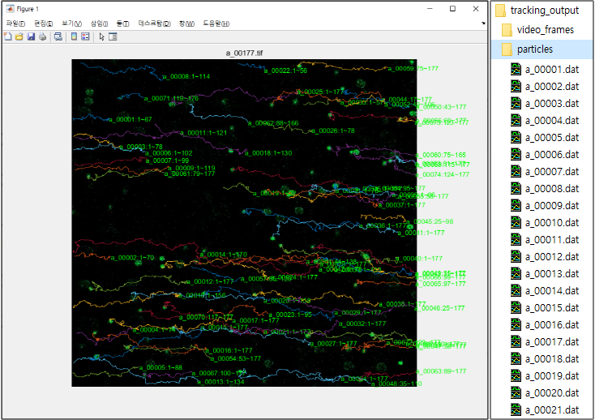

# Particle_Tracking

### Subject

Develop an algorithm for measuring particles' momentum from video.

### Objective

- Extract all frames from a video file.
- Track particles and save the data.
- Plot the result to confirm accuracy.

### Tech

- Image Processing

### Language

- MATLAB

### Result

- Tracking result :

- Result plotting video : https://youtu.be/EuScO7I4GnA

　

### 세부 내용

- 사용자 설정 변수는 코드의 가장 위쪽에 모아두었다.

- 'detect_particles'와 'grouping'과정에서는 트래킹의 정확도에 영향을 미치는 변수들을 잘 조정해야 한다.

  - 'detect_particles'

    - umbral_1, umbral_2 : 이미지 이진화에 사용되는 Pixel intensity threshold

    - area_1, area_2 : 입자의 최소 면적과 최대 면적

    - elipse : 입자의 최대 이심률

      0~1 크기이며 0에 가까울수록 원이다.

  - 'grouping'

    - distance : 1프레임 동안 입자의 최대 이동 거리

      본 영상에서는 입자 최소 지름의 1.1배 정도로 설정하였다.

    - lostn : 트래킹 종료 프레임 값

      'lostn'프레임 동안 'distance'내에 입자가 인식되지 않을 경우 해당 입자의 트래킹을 종료한다.

    - deln : 트래킹 데이터의 최소 길이

      트래킹이 종료된 입자의 데이터 양이 'deln'프레임 미만일 경우 해당 데이터는 저장하지 않는다.

- 한계점

  - 영상의 특성에 따라 트래킹의 정확도가 떨어질 수 있다.
    - 여러 입자가 매우 인접하거나 겹쳐 보이는 경우
    - 영상 도중 입자가 일시적으로 흐려지거나 사라지는 경우 ('lostn'변수로 보완) 
    - 빛 반사로 인해 입자 주변에 고리 모양 잡음이 발생한 영상에서 정확도가 비교적 떨어짐을 확인
    
  - 인식 가능한 입자의 모양이 제한적이다.
    - 원형 입자만 가능
    

